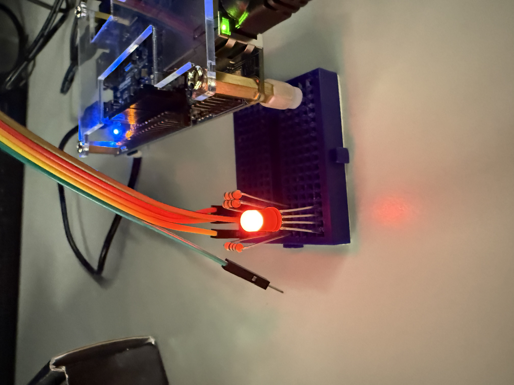
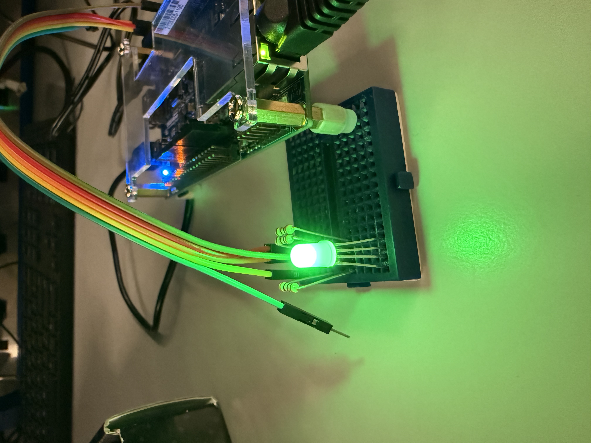
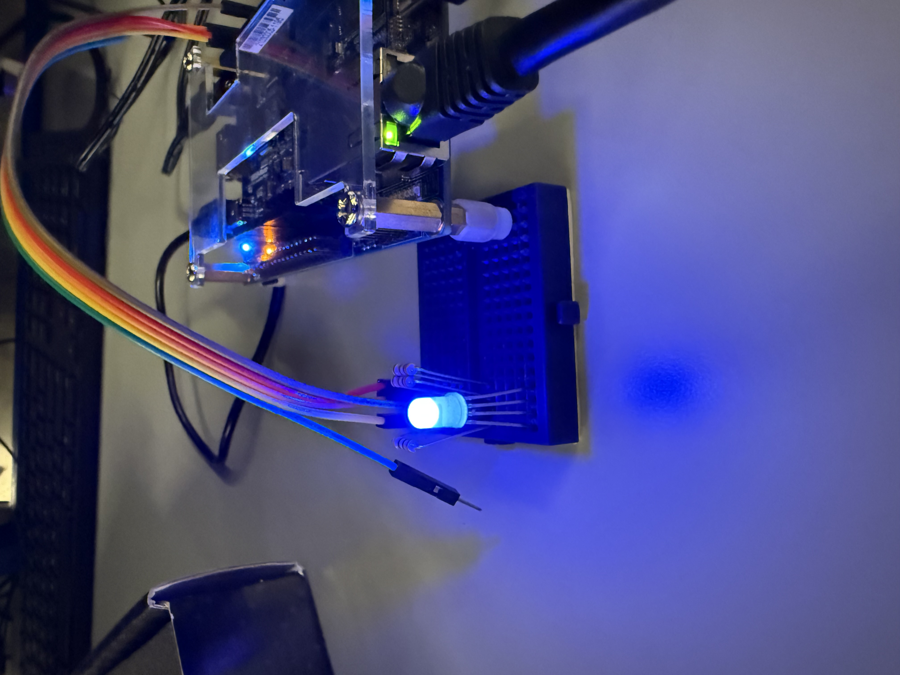
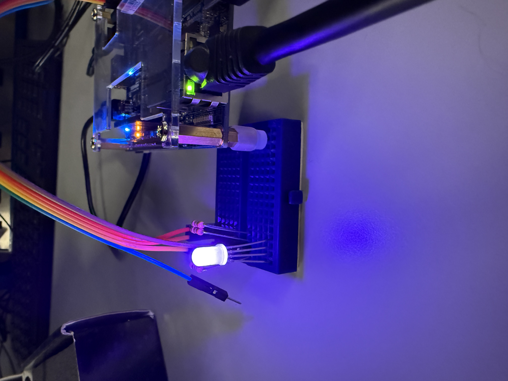

# Homework 10: RGB LED Controller with HPS control

## Overview
In this lab a new quartus project was made for an RGB controller that implements the PWM signal driver from homework 9. This controller includes registers for the period as well as the duty cycles for each color of the RGB LED. 

## Deliverables
### Resistance Calculations:
Resistance needed for the red LED:

$$
R = \frac{5V - 2V}{0.01 A} = 300 Ohms
$$

Resistance needed for the green and blue LEDs:

$$
R = \frac{5V - 3V}{0.01 A} = 200 Ohms
$$

### Pictures of the LEDs with requred colors:
### Red

### Green

### Blue

### Purple (chosen color)

