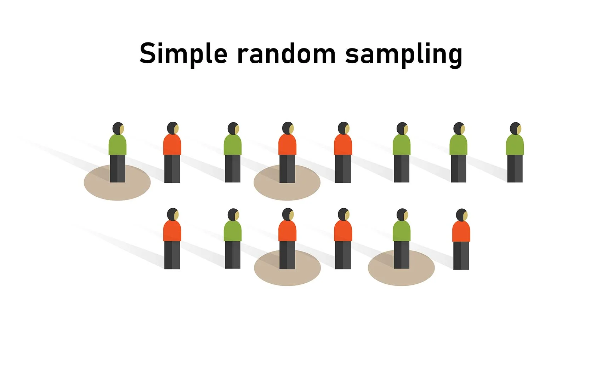

#Here is a first level heading for homework 2
**This is some bold text**
_ITALICIZED!_
```
This
is
a
blockquote
```

> [!WARNING]
> This is a warning alert

```python
for i in range(10):
    print(i)
```

| Column 1 | Column 2 |
|----------|----------|
| Something| Random   |
|more stuff| Yes.     |

- Unordered 1
- Unordered 2
- Unordered 3
- Unordered 4

1. Ordered 1
2. Ordered 2
3. Ordered 3
4. Ordered 4

A wonderful link to google: [Google](https://google.com)



