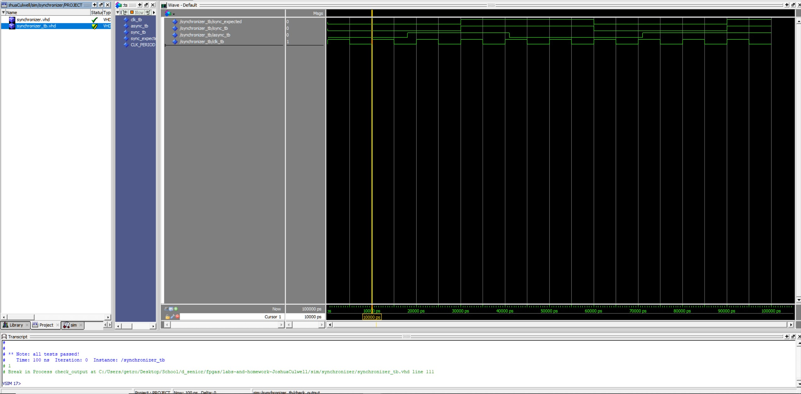

# Submission template

# Homework 3: Synchronizer

## Overview
In this assignment a component was created to help synchronize asynchronous signals using 2 d-flip-flops.

## Deliverables

0xDEADBEEF
