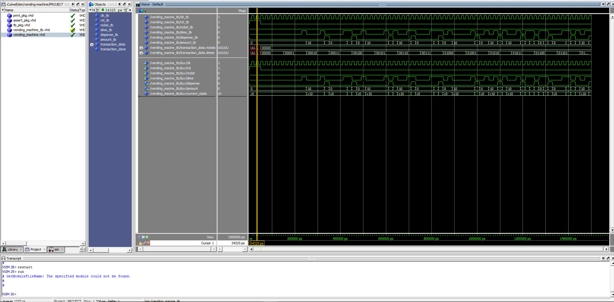

# Homework 5: Vending Machine

## Overview
Develop a finite state machine to handle inputs of nickels and times and output the current amount as well as if we can dispense or not.

## Deliverables

