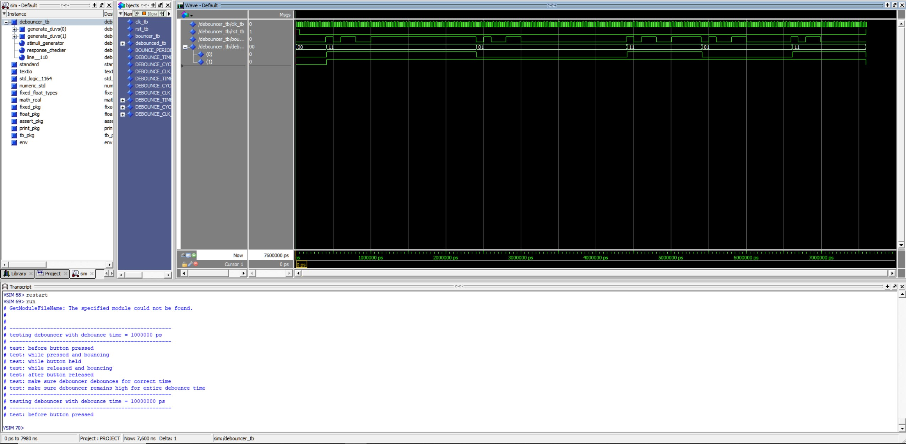
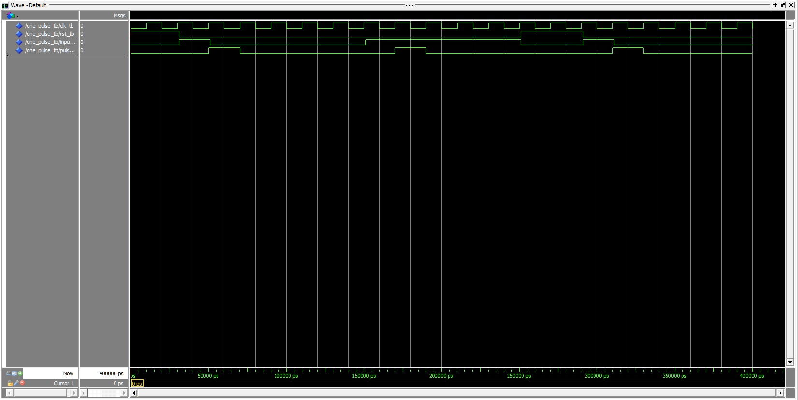
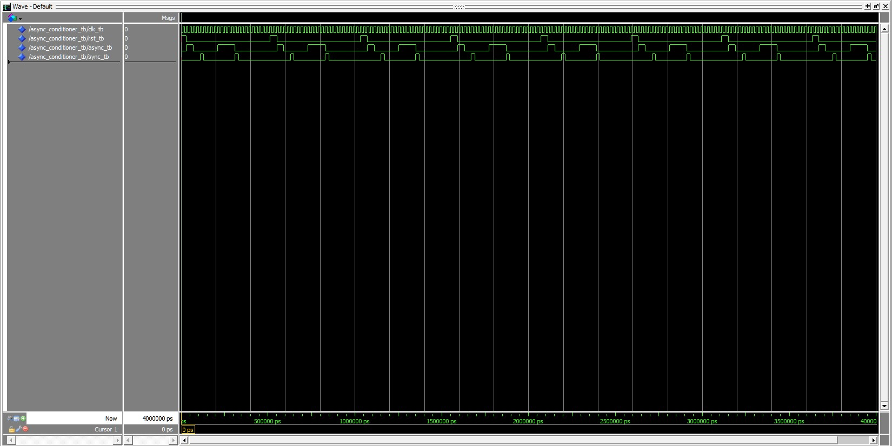

# Homework 6: Async Conditioner

## Overview
The goal of this project is to make a async conditioner which has a synchronizer, debouncer, and one pulse components inside. 
First was to create the debouncer and pass the given debouncer testbench then creat the one pulse, one pulse testbench, then link everything together with the synchronizer made in a previous homework in the async conditioner component.

## Deliverables
Debouncer:

One pulse:

Async Conditioner:

