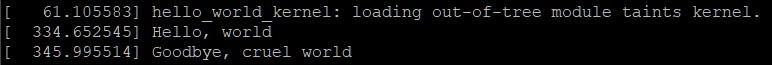
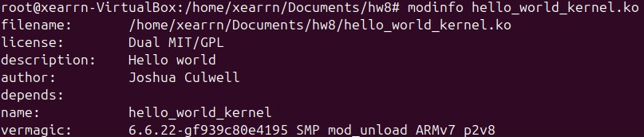
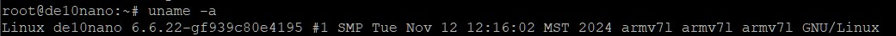
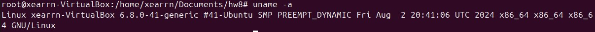

# Homework 8: hw8_hello_world_lkm -- Linux Kernel Modules

## Overview
In this homework we went over how to create a linux kernel modeule then created a hello world module that prints "Hello, world" when loaded then "Goodbye, cruel world" when unloaded.

## Deliverables
### Loading and unloading in the kernel log buffer:


### Modinfo on the kernel module:


### ```uname``` for soc and vm:



