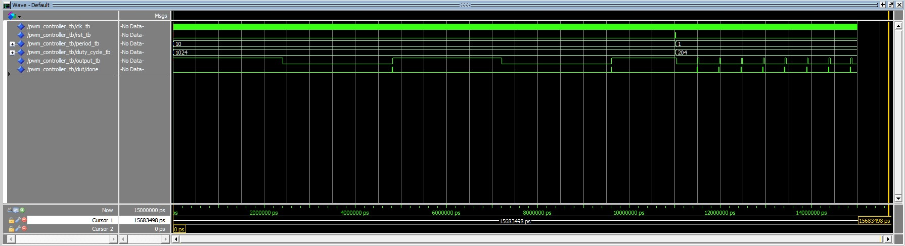
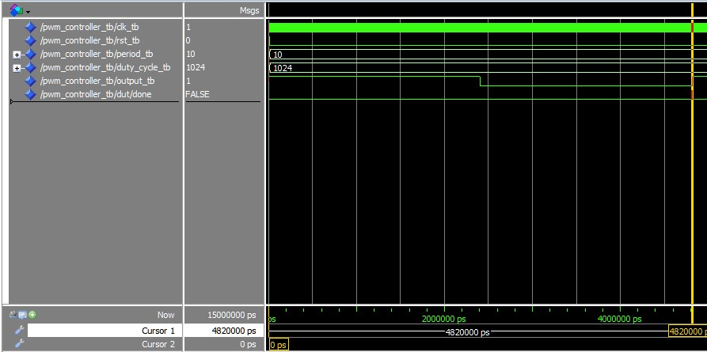

# Homework 9: PWM controller

## Overview
In this homework we made a componenet that takes in a period and duty cycle and the output is only on for duty cycle % of period milliseconds.

## Deliverables
### Testbench output with 2 different periods and duty cycles:

### Testbench output with timing displayed at the bottom:
* Period: "0000000000001010" --> Trying for 5 us but in actuality it's 4.82 us due to not having enough decimal bits.
* Duty Cycle: "010000000000" --> 0.5 or half of the period.

Time displayed at the bottom:

