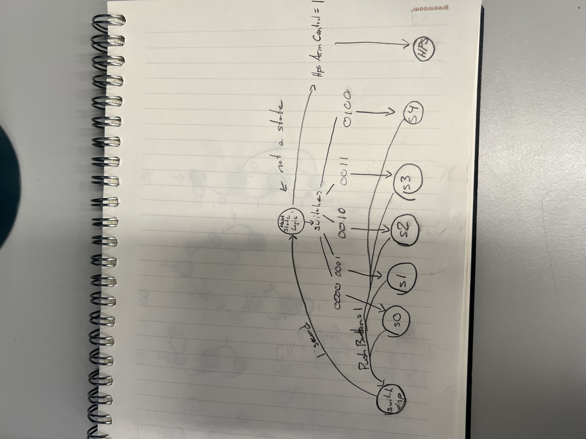
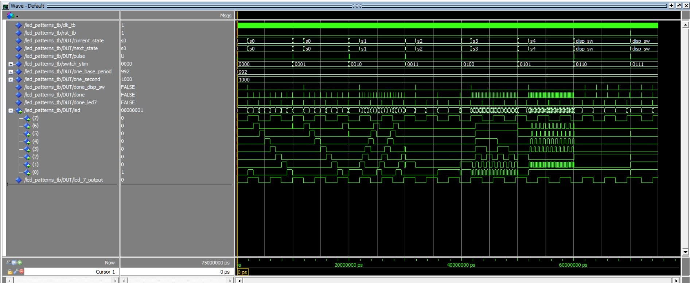

# Lab 4: LED Patterns

## Overview
This assignment was to create a state machine where each state has a different pattern to display on the LEDs.
There should be variable time defined by "base_period" which is a fixed floating point number where the first 4 bits are the integer followed by the next
4 bits that are after the decimal.
To switch states there is a button that, when pressed, will display what is on the switches on the LEDs for 1 second then switch to whichever state number the switches indicate in binary.
State 1: a single led shifting to the right every half base period seconds
State 2: 2 leds side by side shifting to the left every quarter base period seconds.
State 3: A binary up counter that counts up every 2 base period seconds.
State 4: A binary down counter that counts down every eighth base period seconds.
State 5: A new pattern defined by the student.
This should also be set up for hps arm control and when that value is '1' the leds should instead be controlled by the given "led_reg" variable.

There should also be a timer driving led 7 (the patterns are driving leds 6 downto 0) that toggles it on and off every base period seconds.

A block diagram as well as a state diagram should be created prior to starting on code.

## System Architecture
Code Block Diagram:

The timed counter component will be used with a variable to indicate how high to count to. This variable will be selected by each state in order to keep it more simple by using only 1 timer. Each state takes in the timer and outputs to the LEDs. In order to switch which state, the async conditioner is used to turn the button input into a single pulse which is used to drive next state logic which switches to whichever state the switches indicate.

State Diagram:

This diagram has 6 states: s0, s1, s2, s3, s4, hps, and switch disp. Each of these states transition to the switch_disp when the button is pressed in order to meet the requirement of displaying what is on the switches on the LEDs. Once 1 second has passed in the switch disp state, the next state logic takes over and switches the state to whichever state the switches specify of the s0-s4 states. There is also a state called hps which is used to drive the LEDs using led_reg when the user wants the arm computer to contol the LEDs. 

### Implementation Details
The implementation of the final, custom LED pattern was a multiplier. The pattern displayed on the LEDs is the binary value of 1 that is multiplied by 3 every 1/16 of base period seconds. 

### Final waveform

