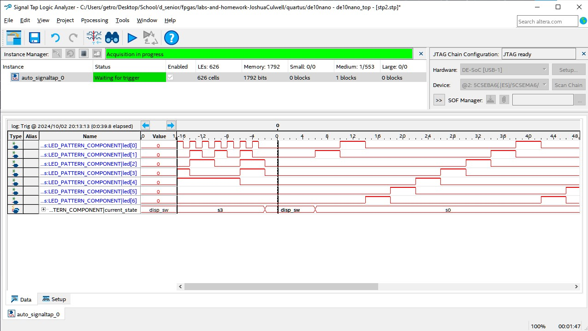
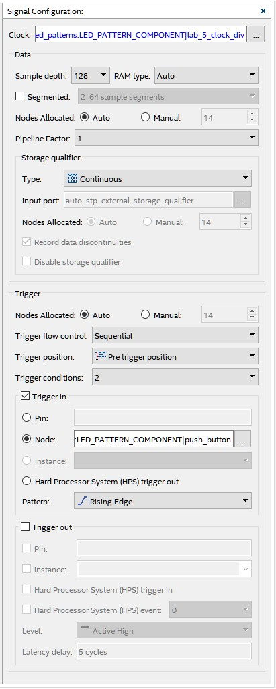

# Lab 5: Signal Tap

## Overview
This assignment is to demonstrate using the signal tap in Quartus for debugging.
For this assignment we must open signal tap, configure the clock and trigger, give the program several "nodes" to track, then to run we must start in state 3 then, with the push button to trigger the signal tap, switch to state 0.

## Deliverables
Waveform:

Configuration Pane:

### Questions 
How much FPGA on-chip memory was required to monitor your signals?
 - 1792 bits of on-chip memory was required to monitor my signals.
