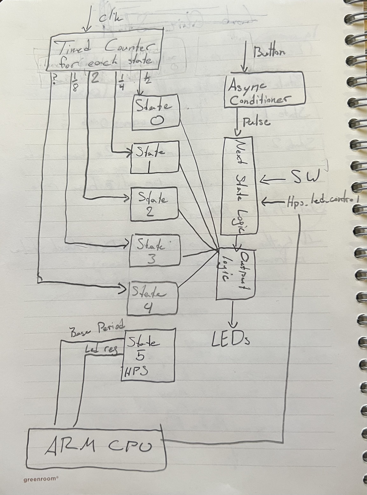

# Lab 6: Using Platform Designer to connect ARM CPU

## Overview
In this lab we updated entities, instanciated registers, created components with platform designer, finished with moving files. 

## Deliverables
### System Architecture:
This overall system is to control LEDs. There are 2 main parts that control the LEDs. The first is a state machine which influences timers such that each state displays a different pattern which is updated at different times depending on that state's requirements. The second controller is the ARM CPU on the FPGA which, when active, the state machine is put into a state that gives the ARM CPU direct control.

### Register Map:
Registers Created:
- led_reg
- base_period
- hps_led_control

Bitfield Diagrams:
led_reg:      [0 upto 7][8 upto 31                      ]
               led_reg    undefined

base_period   [0 upto 7][8 upto 31                      ]
             base_period  undefined

hps_led_control [0][1 upto 31                           ]
         hps_led_control  undefined

How to Read/Write:
Addresses:
00 - base_period
01 - led_reg
10 - hps_led_control

To read:
- set avs_read to '1'
- set address to desired register to read from (see addresses above)
- data will be outputted on avs_readdata

to write:
- set avs_write to '1'
- set address to desired register to write to (see addresses above)
- set avs_writedata to the desired value to store in the register

### Platform Designer:
Questions:
How did you connect these registers to the ARM CPU's in the HPS?
- This was done by adding a signal assignment in the component instantiation in Platform Designer.

What is the base address of your component in your Platform Designer system?
- (base) 0x0000_0000 -> (end) 0x0000_000F

